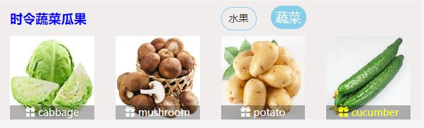

# Introduction
基于 React 框架构建的菜单定制系统，数据通过后台服务器获取。具有注册、登陆、管理定制菜单、浏览菜谱等功能。测试数据通过本地JSON服务器获取，单元测试采用Jest。时间有限，后续还会逐渐追加新功能，功能完善后会部署在托管服务器，网址会在这里公布。

### ^_^
- 如果对您对此项目有兴趣，可以点 "Star" 支持一下 谢谢！
- 后端项目请参照：https://github.com/Alex-T-1024/aemenu-backend

## License
MIT授权的开源项目

## 技术栈
+ HTML + CSS + JavaScript
+ React + React Router + ES6/7 + React Bootstrap
+ Git

# Installation
```
 git clone https://github.com/Emma-1024/aemenu.git
 npm install
```
# Run
```
npm run json-server
npm start
```
后端项目请参照：
https://github.com/Alex-T-1024/aemenu-backend

# 功能列表
- 注册
- 登录/登出
- 浏览菜谱
- 分页
- 定制菜单

## 部分截图
### *首页*

### *种类切换*


### *注册/登录/登出页面*


### *定制菜单功能*


# 其他
- 我们目前正在找工作，如果您感兴趣，请联系以下邮箱地址：
- 前端工程师：yongjie.wu@outlook.com
- 全栈工程师：yepeng.tian@outlook.com
